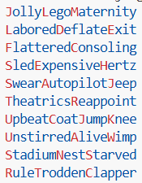

# 🛑Halt! What's the Passphrase?🤔


**Halt! What's the Passphrase?** (HWTP) is a passphrase and password generator written in Python with a command-line interface (CLI) powered by `argparse`.

---

## 🚀 Features

- Generate memorable passphrases of exactly the length you choose

  

- Rich CLI feature set
- Integration with free [Have I Been Pwned](https://haveibeenpwned.com/) API to check for compromise
- Quickly view cached wordlists with `-lw` (lists are numbered)
- Choose which cached dictionary to use with `-d` (accepts a number or name)

---

## 🎮 Fun With Passphrases

Generate a single passphrase:
```bash
python hwtp.py pp
```

Generate 20x colorized passphrases:
```bash
python hwtp.py pp -co -n 20
```

Generate 20x 32-character passphrases:
```bash
python hwtp.py pp -co -n 20 -c 32
```

See all available cached dictionaries:
```bash
python hwtp.py -lw
```

Use a specific cached dictionary by name:
```bash
python hwtp.py pp -d japanese
```

Use a specific cached dictionary by number:
```bash
python hwtp.py pp -d 15
```

Pad the passphrase with a custom string in the middle (on a word boundary):
```bash
python hwtp.py pp -co -pad HWTP! 2
```

Smush 5 words together per passphrase (random lengths):
```bash
python hwtp.py pp -co -n 20 -nw 5
```

Use the [Augenbaum](https://cybersecuremindset.com/) method with parameter `8@`:
```bash
python hwtp.py pp -co -n 20 -au 8@
```

Customize the partition range (advanced):
```bash
python hwtp.py pp --start-n 8 --end-n 40
```

Use random Wikipedia article titles (using their free API) as a source with verbose output:
```bash
python hwtp.py pp -co -w -v
```

Generate multiple Wikipedia passphrases:
```bash
python hwtp.py pp -co -w -n 10
```

Check a single randomly generated passphrase against known breaches using the HaveIBeenPwned.com free API:
```bash
python hwtp.py pp -co -pwn
```

Check a specific password (HaveIBeenPwned.com free API):
```bash
python hwtp.py pwn pokemon1
```

---

## 🔐 Fun With Passwords

Colorized, 20 passwords using only numbers and no consecutive characters allowed:
```bash
python hwtp.py pw -co -nc -n 20 -no l u s -v
```

Generate 20x 10-character password(s) each with a minimum of 4 digits and 4 special characters, with no ambiguous characters (l, I, 1, 0, O), that does not use any lowercase letters, with no consecutive duplicate characters allowed, that is bookended (no numbers or specials as the first or last character).
```bash
python hwtp.py pw -co -nc -n 20 -c 10 -v -no l -md 4 -ms 4 -a -x -b
```

Check a randomly generated password against known breaches:
```bash
python hwtp.py pw -co -pwn
```

🔴 Example of a configuration that **won't work**:
```bash
python hwtp.py pw -co -nc -ms 4 -md 4 -b -n 20 -c 8 -v
```

Generate a password using only special characters, and excluding some of those allowed:
```bash
python hwtp.py pw -co -n 10 -no u l d -sd '@ # $ _ & ( ) / : ; ! ? - ='
```

Only use specific special characters to build a password:
```bash
python hwtp.py pw -co -n 10 -no u l d -so '@ # $ ='
```

### Dictionary Utilities

List cached wordlists (numbered for easy selection):
```bash
python hwtp.py -lw
```

Process a single dictionary with a custom partition range and minimum/maximum word length values, and show rejected words during processing:
```bash
python hwtp.py utils process -d swedish.txt --name Swedish --start-n 8 --end-n 40 --min-chars 8 -minw 3 -maxw 8 -v
```

Skip partition generation (HWTP will use just-in-time partitition algorithm when using this wordlist):
```bash
python hwtp.py utils process -d swedish.txt --name Swedish -p false --min-chars 8
```

Process all dictionaries in `wordlists/`:
```bash
python hwtp.py utils process-all --start-n 8 --end-n 40 --min-chars 8
```

Skip partition generation for all dictionaries:
```bash
python hwtp.py utils process-all -p false
```

Generate a standalone partitions file:
```bash
python hwtp.py utils part -o partitions.json -minw 3 -maxw 8 --start-n 8 --end-n 40
```

Generate a single partition and print it to the console:
```bash
python hwtp.py utils jit -n 50 -minw 4 -maxw 9
```

Generate a single partition and save it to a file:
```bash
python hwtp.py utils jit -n 50 -minw 4 -maxw 9 -save partition.txt
```

### Dictionary JSON Format

Processed dictionaries are stored in `cache/` using a single JSON file:

```json
{
  "metadata": {
    "language": "English",
    "has_partitions": true,
    "min_word_length": 4,
    "max_word_length": 9,
    "min_chars": 10
  },
  "wordlengths": {
    "4": ["haze", "iris"],
    "5": ["brisk", "noble"]
  },
  "partitions": {
    "8": [[4,4], [8]]
  }
}
```
The `partitions` section is optional and only included when available. When a
dictionary lacks partition data, the CLI automatically generates a valid
partition on the fly using secure randomness ("just‑in‑time" partitioning).

---

## 📦 Installation

Clone this repo and run:
```bash
pip install -r requirements.txt
```
This will install the required packages `colorama` and `requests`.

Or simply use the Python file directly if dependencies are already met.

---

## 🛠 Requirements

- Python 3.6+
- `colorama`
- `requests`

---

## 🧠 License

[Unlicense](https://unlicense.org/) – do with it what you will, and may your passphrases not end up in HaveIBeenPwned 💪

---

## 🙌 Contributions Welcome!

Unless you're a 🤖

---

## 📫 Contact

https://github.com/Unic0rn0ver10ad
